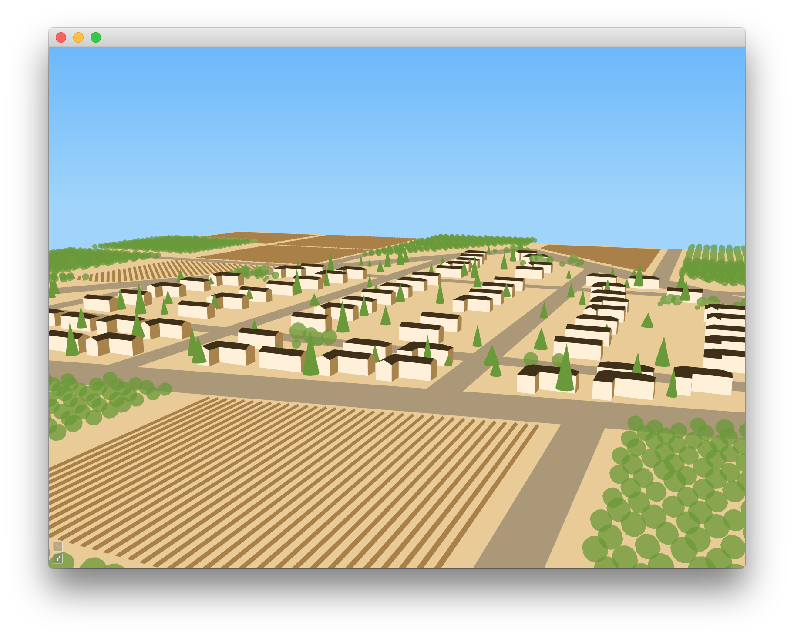

# Cityscape


This project was inspired by [Donald Crews' book Flying](http://www.amazon.com/gp/product/0688092357).
My wife had gotten the book for our son, but having loved [Truck](http://www.amazon.com/Truck-Donald-Crews/dp/0688104819)
as a child, I fell in love with the style and thought it would be fun to spend
a weekend writing a program to generate a city in his style.

As I worked on an algorithm to divide a blocks into lots, I realized that rather
than a topic for a weekend project, it really a topic for a PhD thesis.
Fortunately. [Tom Kelly has already written that thesis](http://twak.blogspot.com/2014/02/unwritten-procedural-modeling-with.html),
and it's fascinating. His survey of procedural modeling techniques gave me a ton
of ideas and he's included an algorithm for using the block's straight skeleton
to partitioning it into lots.

The goal of this project is an app that will accept a series of roads, and
generate a city of buildings in Crews' style, around them. I decided to use the CGAL
library for its straight skeleton and that forced me to learn a lot about C++
templates, which slowed my progress. But as I've started to discover how to use
it, I found the breadth of CGAL's functionality to be amazing. It may not do it
fast, but it'll do it accurately.




## Installation

Clone this repo:

```
git clone https://github.com/drewish/Cityscape.git
```

Install Cinder 0.9.1dev in a sibling directory:

```
git clone --recursive https://github.com/cinder/Cinder.git
Cinder/xcode/fullbuild.sh
```

Install CGAL 4.9 using homebrew:

```
brew install cgal
```

Open the app up in Xcode:

```
open Cityscape/xcode/Cityscape.xcodeproj
```
